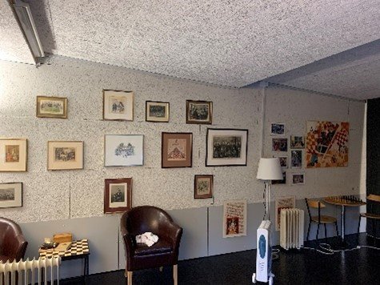
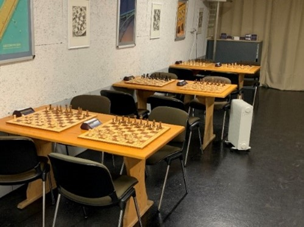

+++
title = "Das Spiel der Könige"
date = "2023-06-16"
draft = false
pinned = false
tags = ["Deutsch", "Reportage"]
image = "tische_mit_brettern.jpg"
+++


In stark umkämpften Partien, bei denen jeder kleine Fehler über Sieg oder Niederlage entscheidet, spiele ich um den Sieg eines Turniers des Schachklubs Bern.



Von Timon Stalder und Christian Studer Datum Publikation 

Angestrengt sitze ich mit gerunzelter Stirn an einem Schachbrett. Mein König steht mit dem Rücken zur Wand und es gibt keinen offensichtlichen Ausweg mehr. Ich weiss, dass diese Stellung nicht mehr zu retten ist, und trotzdem spiele ich noch weiter. Ich werfe einen Blick auf die Uhr. Es verbleiben mir noch fünfzig Sekunden. Ich schiebe meinen König ein Feld nach rechts. Wie sich herausstellt, ein fataler Fehler. Die gegnerische Dame schlägt meinen letzten Bauern und plötzlich blockieren meine eigenen Figuren den Fluchtweg meines Königs. Ich werfe meinen König um und gebe auf. Ein Schachmatt war nicht mehr zu verhindern. Ich reiche meinem Gegner die Hand und gratuliere ihm zum Sieg. Meine Hoffnungen auf den Turniersieg sind schon in der dritten Runde geplatzt.  

#### Mein erster Eindruck 

Ich überquere den Altenbgersteg, biege nach links ab und folge dem Ufer der Aare. Kurz darauf stehe ich vor einem einstöckigen, sehr langen Haus, das mich ein bisschen an einen Tierstall erinnert. Das Haus ist jedoch nicht Teil eines alten Bauernhofes, sondern verdankt seine Form der Kegelbahn, die sich früher darin befunden hat. Das Haus gehörte nämlich ursprünglich dem Kegelklub Bern. An einem Schild über dem Eingang kann man den jetzigen Besitzer ablesen. Dieses Lokal ist seit neustem im Besitz des Berner Schachklubs. 

Von aussen wirkt das Haus ein bisschen heruntergekommen. Nervös trete ich durch die Tür und bleibe überrascht stehen. Drinnen fühle ich mich wie in einer neuen Welt. Fein säuberlich sind in einer langen Reihe Schachbretter auf Tischen aufgestellt. An allen Wänden befinden sich Bilder und Poster über Schach. Im Eingang ist der Boden wie ein Schachbrett mit schwarzen und weissen Feldern gemustert. Von aussen kann man noch die Spuren einer kürzlichen Überschwemmung sehen, doch hier drinnen wirkt es, als hätte dieses Lokal seit Jahren keine schlechten Zeiten mehr erlebt. Ich werde von Oliver Marti, meinem Interviewpartner, begrüsst. Er bietet mir etwas zu trinken an. Mit einem Glas Holunderbeerensirup in der Hand werde ich von Marti durch das Lokal geführt. Die Inneneinrichtung des Lokals ist ungefähr so, wie ich es mir vorgestellt habe. An den Wänden hat es Regale voller Schachbücher und in einer Ecke steht ein riesiges Vorzeigebrett.

Was ich jedoch nicht erwartet habe, ist, dass sich hier nicht alles um Schach dreht. Denn hier wird viel mehr als nur Schach gespielt. Im hintersten Teil des Lokals hat es noch andere Spiele und in der Mitte all dieser Spiele steht ein Shogiset, ein Set des japanischen Schachs. Oliver Marti ist der Shogimeister hier im Schachklub. Schon bei der Erklärung der Figuren verstehe ich nichts mehr. Ich entscheide mich dazu, lieber beim Schach zu bleiben. Nach einer ausführlichen Tour durch das Lokal setzen wir uns in einer Ecke auf zwei Sofas und führen das geplante Interview durch. 

> „Romantisch, aggressiv, kreativ! So ist mein Spielstil“ 
>
> *\-Oliver Marti*



#### Wer ist Oliver Marti?

„Romantisch, aggressiv, kreativ!“ So beschreibt der Jugendleiter und -trainer des Schachklubs Bern seinen Spielstil. Nebenbei spielt Oliver Marti in der 2. Mannschaft des Schachklubs und somit jeweils in der 1. Liga der schweizerischen Mannschaftsmeisterschaft und der schweizerischen Gruppenmeisterschaft. Zum Schachklub Bern, auch SK-Bern genannt, ist Marti durchs Gartenschach gekommen. Die Szene des Gartenschachs zeichnet sich dadurch aus, dass alle Spiele auf den grossen, öffentlichen Brettern ausgetragen werden. Marti war einer der begabtesten Spieler der bernischen Gartenschachszene. Deshalb wurde der Präsident des SK-Bern auf ihn aufmerksam. Bald darauf war er ein nicht mehr wegzudenkender Spieler für den Schachklub. Denn Marti ist einer der begabtesten Spieler seiner Mannschaft. Doch wie ist er zum Schach gekommen? Dafür muss man einen Zeitsprung in seine Kindheit machen.  

Schon in jungen Jahren hat Marti ein eigenes Schachset besessen. Damals hat er sich immer gewundert, wieso in seinem Schachset Pferdchen und Türme sind und wie sich all diese Figuren bewegen. So lernte er schon bald die Regeln des Spiels, welches heute seinen Beruf ausmacht. Beruflich ist Marti Geschäftsführer des Schweizerischen Schachbundes, Kassier der Bernischen Schachgemeinschaft und Vorstandsmitglied des Kantonal Bernischen Schachbundes. Man läge jedoch falsch, wenn man denken würde, dass dies alles ist. Neben seinen Berufen ist Marti bis zu viermal pro Woche im Schachklub Bern und spielt auch online immer wieder Schach. Mit seinem interessanten Spielstil, der viele Gambits, also bewusste Opfer von Bauern oder sogar Figuren in der Eröffnung beinhaltet, fährt er regelmässig schnelle Siege gegen unwissende Gegner ein. Trotzdem hat es ihm bis jetzt nicht zu einem Titel gereicht, da der Schweizerische Schachbund den Titel des Nationalen Meisters nicht verteilt.



„Gegen einen früheren Weltmeister habe ich ein sehr riskantes Gambit gespielt.“ 

> *\-Oliver Marti*

#### Austausch mit anderen Schachbegeisterten 

Unterdessen fängt es langsam an zu dämmern. Nach und nach treffen immer mehr Turnierteilnehmende ein. Ein paar scheinen sich zu kennen, während andere anscheinend zum ersten Mal hier sind. Ich bin erleichtert, dass ich nicht der Einzige bin, der neu ist. Die Stimmung ist sehr entspannt und alle gehen nett und freundlich miteinander um. Ein paar der Teilnehmenden wärmen sich auf, indem sie schon einmal ein paar Partien spielen. Auch ich schliesse mich ihnen an und spiele im Voraus eine Runde Schach. Ein paar Teilnehmende unweit von mir diskutieren lauthals über ihr Eröffnungsrepertoire. Eine Schacheröffnung ist eine gewisse Abfolge von Zügen, die zu Beginn einer Partie gespielt wird. Diese Züge sind nicht zufällig, sondern sind von vielen Menschen und Computern analysiert worden und haben sich über die Jahre als die besten herausgestellt. Es gibt sehr viele Schacheröffnungen und jede hat ihre Vor- und Nachteile. Wenn man eine Eröffnung gut beherrscht, kann man sich schon zu Beginn des Spiels einen entscheidenden Vorteil verschaffen.  

Wie ich schnell feststelle, sind ein paar der Gäste blutige Anfänger. Es gibt jedoch auch andere, die anscheinend schon ihr ganzes Leben lang Schach spielen. Ich persönlich habe als Kind ab und zu Schach gespielt und habe vor ein paar Monaten wieder angefangen, aktiv mit meinen Kollegen zu spielen. An einem Turnier habe ich jedoch noch nie teilgenommen. Nachdem ich meine kurze Partie beendet habe, gehe ich auf ein paar Leute zu und spreche sie an. Schnell stelle ich fest, dass ich mich sehr gut mit ihnen verstehe. Während ich mit den anderen Teilnehmenden spreche, vergeht die Zeit wie im Fluge. 



#### Auszug aus dem Interview mit Oliver Marti, Jugendtrainer beim Schachklub Bern

Sie sind sehr engagiert in der Szene, wie ist das für Ihr Umfeld, also die Leute, die kein Schach spielen? Ist das manchmal ein bisschen nervig für die?  

Meine Familie kennt sich halt mehr mit Jassen, Schwingen und Skifahren aus. Da der schweizerische Schachbund einen Milizvorstand hat, also einen Vorstand, der noch einem normalen Beruf nachgeht, muss ich viel am Wochenende arbeiten. Das macht dann auch gewisse Beziehungstechnische Sachen ein bisschen schwieriger und man muss etwas spontaner sein. Mein Umfeld spürt auf jeden Fall, dass ich Schach spiele, aber es ist auch so, dass, wenn man Schach spielt, dass die Schachspieler auch zum eigenen Umfeld werden.  Ich bin hier viel im Verein. Es gab Zeiten da war ich drei bis viermal die Woche hier. Jetzt diese Woche werden es zweimal sein, eben heute und am Klubabend. 

Wenn Sie Ihren Spielstyl in drei Worten beschreiben müssten, was wären das für Worte?  

Romantisch, aggressiv, kreativ. Ich bin nicht unbedingt ein klassischer Spieler. Ich suche jedoch klassische taktische Muster und kenne mich bei klassischen Partien gut aus, also bei Partien, die älter sind als 100 Jahre. Ich spiele viele Gambits, also Bauernopfer in der Eröffnung. Ich liebe es kreative Sachen zu spielen und scheue auch nicht davor zurück, dies gegen ganz starke Spieler zu tun. Ich habe auch einmal gegen den früheren Weltmeister Vladimir Kramnik in einer Partie ein sehr riskantes Gambit gespielt.



#### Das Turnier 

Plötzlich wird das laute Gerede der Turnierteilnehmer von einem Gong unterbrochen. Sofort werden alle still. Ein Mitglied des Schachklubs liest die ersten Spielpaarungen herunter. Ich wurde einem Schachbrett im hinteren Teil des Lokals zugewiesen, was bedeutet, dass ich gegen einen eher schlechteren Spieler antreten werde. Nervös setze ich mich hin. Während ich auf meinen Gegner warte, denke ich an Martis Tipps: „Lass dich nicht von der Schachuhr durcheinanderbringen. Denk daran, auf die Uhr zu drücken, und nimm dir die Zeit, die du brauchst. Es ist ein Amateurturnier, hier werden kleinste Zeitvorteile nicht so hart bestraft.“ Diese Tipps hat er mir am Ende des Interviews, das ich vor dem Turnier mit ihm geführt habe, auf den Weg gegeben. Endlich setzt sich mein Gegner auf die andere Seite des Brettes. Ich schüttle ihm die Hand und wir wünschen uns gegenseitig eine gute Partie. Ich spiele mit Weiss, was bedeutet, dass ich anfangen darf. Mein Gegner startet die Schachuhr und ich mache meinen ersten Zug. Ich spiele zum ersten Mal mit einer Schachuhr und bin deshalb zuerst ein bisschen verwirrt. Doch schon bald bemerke ich, dass es gar nicht so schwierig ist, mit einer Uhr zu spielen. Eine Schachuhr funktioniert so, dass beide Spieler zu Beginn eine gewisse Anzahl Zeit bekommen. Während man am Zug ist, läuft die eigene Zeit herunter. Sobald man seinen Zug gemacht hat, drückt man auf den Knopf und die Zeit des Gegners beginnt runterzuzählen. Hat ein Spieler keine Zeit mehr, hat er die Partie automatisch verloren. Das heisst, eine Partie kann durch Schachmatt oder durch das Auslaufen der Zeit enden.  

Meine erste Partie verläuft sehr gut. Schon nach zehn Zügen kann ich die Dame meines Gegners schlagen und kurz danach setze ich ihn Matt. Nachdem wir uns die Hand gereicht haben, stehe ich auf und melde unser Resultat bei der Turnierleitung. Dann muss ich warten, bis alle Partien fertig sind und die neuen Paarungen vorgelesen werden. Während ich warte, schaue ich den anderen Turnierteilnehmern bei ihren Partien zu. So vergeht der Abend, Partie nach Partie. Einige gewinne ich und andere verliere ich. In einer Partie, auf die ich auch besonders stolz bin, kann ich sogar noch ein Remis herausholen, obwohl ich drei Bauern weniger hatte.  

Eine Sache, die mir besonders auffällt, ist, wie anstrengend Schach sein kann. Schon nach drei Partien konnte ich mich nicht mehr zu hundert Prozent konzentrieren, da ich von einem starken Hungergefühl geplagt werde. Tatsächlich kann man dieses Phänomen auch im Profischach beobachten. Professionelle Schachspieler können in einem einzigen Schachspiel bis zu 6000 Kilokalorien verbrennen. Das ist ungefähr der dreifache Tagesbedarf einer durchschnittlichen erwachsenen Person. So stark ist der Effekt bei mir wohl nicht, spüren tue ich ihn jedoch trotzdem. Der einzige Weg, wie ich mich weiterhin konzentrieren kann, ist es, Zucker zu mir zu nehmen. Dies ist zwar nicht allzu gesund, aber es hilft mir, mein Konzentrationslevel innert ein paar Minuten wieder stark zu erhöhen.  

#### Siegerehrung 

Nach einer halben Unendlichkeit und sieben intensiven Begegnungen endet das Turnier. Anhand der gewonnenen Spiele wird die Rangliste erstellt. Leider bin ich nicht bis ganz an die Spitze gekommen. Ich bin jedoch mit meiner Platzierung im vorderen Mittelfeld zufrieden. Schliesslich war dies mein erstes Schachturnier. Jeder auf dem Podium bekommt jeweils einen kleinen Pokal als Anerkennung. Dem Sieger wird vom Präsidenten sogar ein Jahr Klubmitgliedschaft geschenkt. So findet dieses lustige und trotzdem sehr kompetitive Turnier ein Ende.  

Draussen ist es schon stockdunkel. Vor lauter Schachspielen habe ich die Zeit komplett vergessen. Nach und nach verlassen die Teilnehmer das Lokal und auch ich verabschiede mich. Ich trete in die kühle Nachtluft hinaus. Es ärgert mich immer noch, dass ich die Chancen auf einen Turniersieg schon in der dritten Runde grundlos weggeworfen habe. Ich weiss, dass ich diese Partie hätte gewinnen können und deshalb nervt mich die Niederlage umso mehr. Abgesehen davon hat mir das Turnier mir jedoch erstaunlich viel Spass gemacht und ich könnte mir durchaus vorstellen, wieder einmal an einem Turnier teilzunehmen. Obwohl es mir sehr gefallen hat, bin ich froh, dass das Turnier ein Ende gefunden hat. Diese paar wenigen Stunden, in denen ich mein Konzentrationslevel so hoch halten musste, haben mich enorm erschöpft. So gehe ich in der Finsternis tief durchatmend zurück über den Altenbersteg.