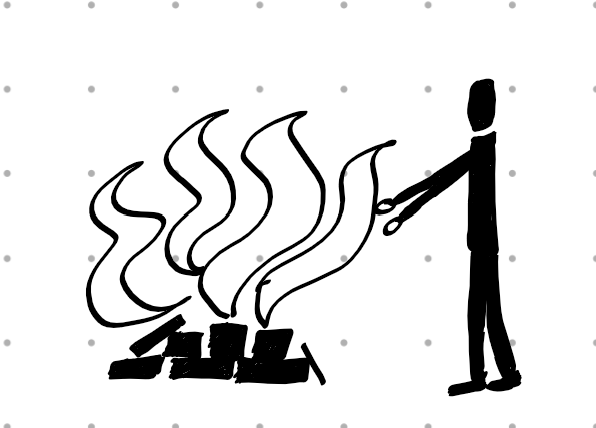
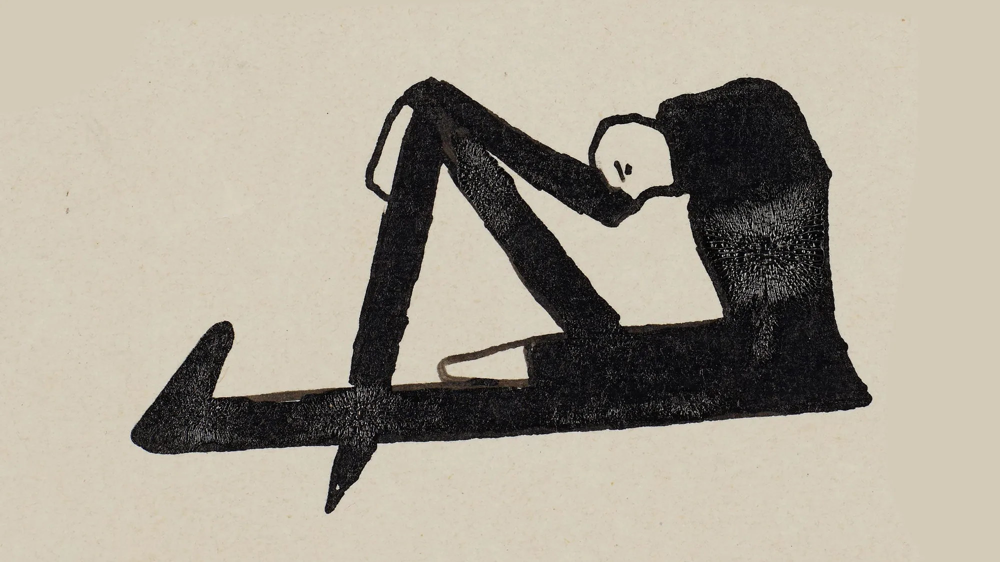
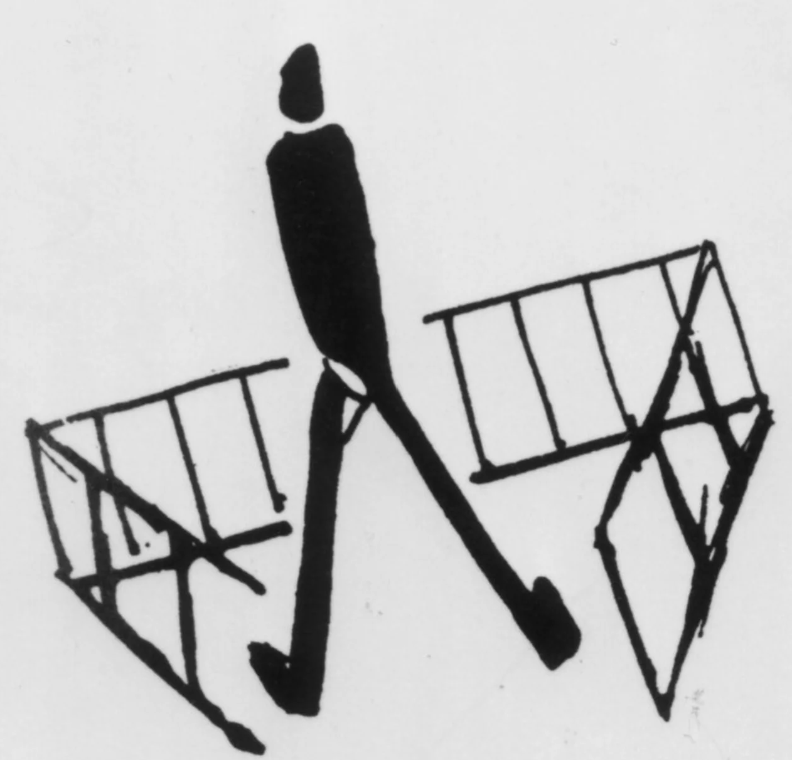

+++
title = "Warum ich Kafka nicht mag"
date = "2024-05-25"
draft = false
pinned = false
tags = ["Deutsch", "Kafka"]
image = "max_brod.png"
footnotes = "**Bilder:**\n\n<https://www.zeit.de/2024/05/franz-kafka-humor-literatur-geschichte>\n<https://www.franzkafka.de/fundstuecke/der-grosse-zeichner>"
+++
Ich sitze gelangweilt im Deutschunterricht und schaue aus dem Fenster. Gerade diskutiert die Klasse über den Text «Die Verwandlung» von Franz Kafka. 
Franz Kafka war ein in Prag lebender und arbeitender jüdischer Jurist. Er war deutschsprachig. Nebst seinem Beruf als Jurist, in dem er vor allem die Interessen von Arbeitern vertrat, hatte er zum Leiden vieler Schüler*innen einen Hang zum Schreiben. Kafka starb an Tuberkulose und ordnete vor seinem Tod an, dass seine unveröffentlichten Werke von seinem besten Freund Max Brod verbrannt werden sollten. Max Brod folgte diesem letzten Wunsch jedoch nicht -und veröffentlichte die Texte entgegen Kafkas Willen. Schade eigentlich, vielleicht wäre mir das ganze Kafka-Geplänkel erspart geblieben, wenn Brod die Texte einfach verbrannt hätte.

Ich versuche mich jetzt schon zum dritten Mal darauf zu konzentrieren, was im Unterricht besprochen wird, aber es gelingt mir einfach nicht. Ich fand zwar den Deutschunterricht noch nie besonders spannend, aber solche Schwierigkeiten, mich auf den Unterricht zu konzentrieren, hatte ich schon lange nicht mehr. Einige Dinge, wie zum Beispiel, dass Kafka mit der Verwandlung erstaunlich gut die NS-Zeit vorausahnte, obwohl er eigentlich vor der ganzen Geschichte lebte, bleiben hängen. In seinem Werk «Die Verwandlung» wird ein Mensch zu einem Ungeziefer und verliert nach und nach das Ansehen seiner Familie, bis der Protagonist schlussendlich tatsächlich von allen Familienmitgliedern als Ungeziefer wahrgenommen wird. Diese Verwandlung beschreibt also etwas ähnliches wie den Holocaust.  Aber abgesehen von den zwei, drei Dingen, die ich mir merken konnte, verlassen die besprochenen Inhalte schneller meinen Kopf als das Geld der Investoren die Credit Suisse. Und wie ich so da sitze und mich einfach nicht auf den Unterricht konzentrieren kann, kommt mir plötzlich die Frage in den Kopf: «Wieso sind eigentlich so viele Menschen von Kafka fasziniert, und warum löst eben genau dieser Autor bei mir so wenig aus, dass ich im Unterricht fast einschlafe?»
Es ist klar, dass Kafkas Texte eine enorme Wirkung auf die Lesenden haben können. Zum Beispiel bekam Kafka ein Angebot von einem Journalisten, dass dieser alles von Kafka drucken würde. Ein Angebot, welches sicherlich nicht jede Person einfach so erhalten würde. Ein Grund für diese Wirkung der Texte könnte sein, dass Kafka sehr gut mit Sprache umgehen konnte. Seine Formulierungen wirken vordergründig einfach, trotzdem trifft Kafka mit seiner Wortwahl den Nagel meist auf den Kopf. 
Zusätzlich fällt an Kafka auch auf, dass seine Texte auf viele Weisen interpretiert werden können. Es gibt nicht wie in Texten von manch anderen Autoren die eine richtige Interpretation. Das Faszinierende ist, dass sich die Interpretationen bei Kafkas Texten nicht gegenseitig ausschliessen. Jede Person kann sich selbst aussuchen, was der Text bedeutet, was wiederum dazu führt, dass sich jede Person die Interpretation sucht, die für sie am besten passt. Dadurch sehen alle Kafka in einem für sie positiven Licht. Aber reicht all dies, um Kafka zum berühmtesten deutschen Autor zu machen?
Meiner Meinung nach kann Kafkas Berühmtheit nicht nur von seinen Fähigkeiten kommen.  Sicherlich gehörte auch eine ordentliche Portion Glück dazu, welche Kafka an die Spitze deutscher Autor*innen katapultierte. Und seit sich Kafka an eben dieser Spitze befindet, fand meiner Meinung nach eine Art «confirmation-bias» statt. Alles, was Kafka geschrieben hatte, wurde dermassen überanalysiert, dass unterdessen niemand mehr so genau weiss, was Kafka anfänglich meinte und was nun von der Schwarmintelligenz dazu gedichtet wurde. Somit wird Kafka vieles zugesprochen, was er eigentlich gar nie beabsichtigte. Kafka-Anhänger drehen sozusagen jedes noch so kleine Steinchen um, und auch wenn sich nichts darunter befindet, wird dies als unglaubliche Sensation gewertet.
Ein gutes Beispiel dafür wären auch Kafkas Zeichnungen¬ – welche wirklich einfach unglaublich hässlich sind –, die laut Kafka-Experte Reiner Stach die unglaubliche Begabung von Kafka zeigen sollen. Meiner Meinung nach ist dies einfach ein schlechter Witz! 

Kafkas Berühmtheit entspringt einer Kombination seiner Fähigkeiten, Glück und einer ordentlichen Portion overhyped sein (Jugendsprache, bitte nicht mich roasten). Daher bleibt für mich: Ich verstehe Kafka nicht, werde die Faszination nie verstehen und will sie auch nicht verstehen.


In diesem Blog versuchte ich, nicht nur sachliche Inhalte aus meinem Deutschunterricht zu verarbeiten, sondern auch meine persönlichen Eindrücke. Dies tat ich ziemlich offensichtlich, indem ich meine persönlichen Gedanken unbeschönigt in den Text einbettete. Da ich einen sehr grossen Teil über meine persönlichen Ansichten schrieb, habe ich keine KI verwendet, da es meiner Meinung nach ein bisschen komisch wäre, KI über die eigene Meinung schreiben zu lassen. Zusätzlich versuchte ich im Blog immer wieder zwischen persönlichen Wahrnehmungen und allgemeinen Fakten zu wechseln. Dies macht den Text meiner Meinung nach spannender, da man viel mehr emotional eingebunden wird, als wenn der Blog nur sachlich währe. Zugegeben: vielleicht habe ich mancherorts ein bisschen übertrieben. Im Großen und Ganzen machte mir das Verfassen dieses Blogs jedoch mehr Spass als das anderer, da ich freier schrieb als normalerweise. 
